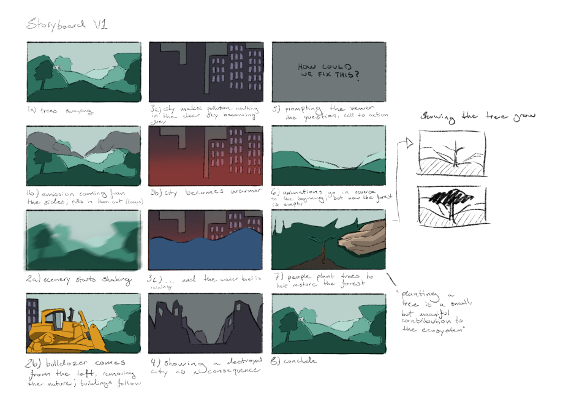
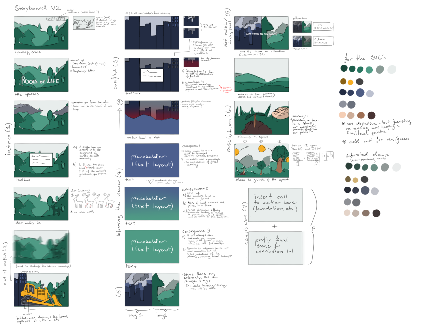

# Project overview and purpose

In this obligatory assignment, we've been tasked to create an engaging story based on one of UN's Sustainable Development Goal using CSS, SVGs, animations, and scroll- and storytelling techniques. We chose Goal 15: "Life on land", wishing to focus on the importance of trees when it comes to fighting against the climate battle, and consequences of deforestation on our planet. The ultimate purpose of the project is to raise awareness about this issue, and inspire action towards conservation efforts among the viewers. You can view our story here: [(link to Github pages)](https://advancedcss2024.github.io/idg1292-2024-oblig3-group01/).

## Brainstorming

We first decided on a plot, and drew rough sketches of scenes we wished to include. It was important that the story had a definied beginning, middle, and end, and that we told it in a conscise manner to make our message and call to action as clear as possible. We wished to use CSS animations combined with facts to tell our story.

## Storyboard

It was important to create a storyboard to know how to proceed with the implementaion of the website. We ended up creating two version of our story:

We decided on a simplistic art style with distinctive silhouettes to make sure our story was easily understandable. The overall style was consistent due to us drawing everything ourselves in a similar manner, and having a limited color palette that was vibrant but slightly muted. In the end, we didn't adhere fully to either of the storyboards, as we found out certain parts were unecessary along the way.

We aimed to create a story that everyone could easily engage with by keeping important UX design principles in mind from the start, such as consistency, accessibility (contrast, reduced motion), and a clear visual hierachy.

## Animation, interactivity and observers

The technology stack employed is HTML, CSS and JS. The animations are exclusively made using CSS keyframes, with JS to bind the scroll- and storytelling together. We mainly used transform and opacity animations, but also included other ones such as changing positioning and height values of certain items. We added an interaction in the form of a button, where the user can click on the button to plant a seed.

Observers were used mainly to see when elements exited/entered the window which then managed states of booleans. It also called functions and added/removed classnames depending on states of booleans and/or positioning of elements.

EventListeners were also used. Managing some booleans and most of all scrolling, which initiates functions based on the parameters set. Since the page itself was "still", the scrolling is managed by eventListener "wheel": calls functions which then update the value stored in variables accessed in .scss, so all styling is done in .scss.

### List of animations

- transform (translate, rotate, skew): text, patches, parts of bulldozer, trees, water, seed, bird, plants
- opacity: text, scenes, CSS drawing of city, transitions (generally)
- color change (background-color, box-shadow): buildings, red sky, CO2 gas
- width/height: CO2 gas, water
- position: headline, deer, bulldozer, trees
- padding: buildings
- path data: seed (growing into a sapling)
